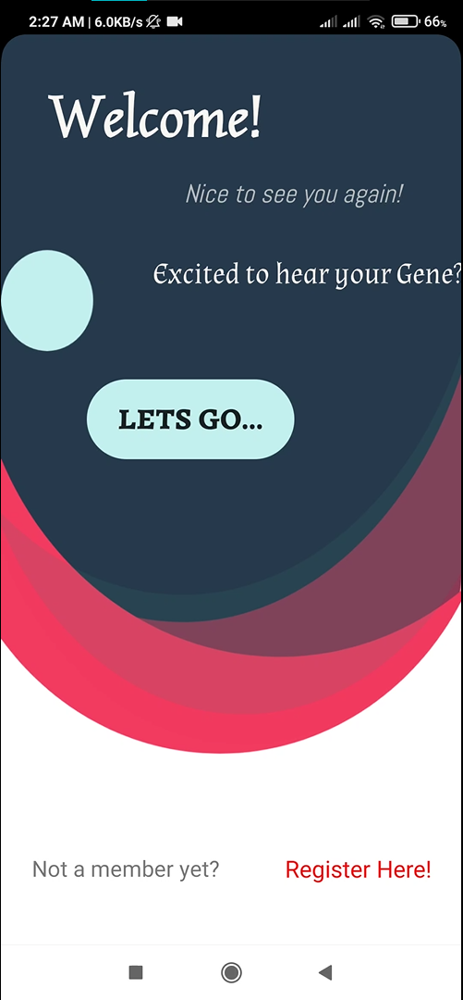

<h2 align ="center"> Traverse Indoor(Gene Reader App)</h2>

#### Watch a short `2 Min` Video of Project with Explanation(Recommended): 🔗<a href="https://youtu.be/grEA2S86fxA" target="_blank">Click Here.</a>
#### Watch full working Video of Project(No explanation): 🔗<a href="https://youtu.be/-OCHKP7xxXE" target="_blank">Click Here.</a>
#### To Read the Documentation of Project on GeeksForGeeks: 🔗<a href="https://www.geeksforgeeks.org/project-idea-traverse-indoor-gene-reader-app/" target="_blank">Click Here.</a>
#### 

<h2> Table of Contents: </h2>

- [Inspiration Behind the Project:](#inspiration-behind-the-project)
- [Targets:](#targets)
- [Tools and Technology Used in Project:](#tools-and-technology-used-in-project)
- [Features:](#features)
    * [1. Predictive - Analysis:](#1-predictive---analysis)
    * [2. Nucleotide Blast Operation(Basic Local Alignment Search Tool):](#2-nucleotide-blast-basic-local-alignment-search-tool-operation)
    * [3. Offline Medications:](#3-offline-medications)
    * [4. Family Reminders:](#4-family-reminders)
- [How we aim at solving the Solution:](#how-we-aim-at-solving-the-solution)

<h2>ScreenShots</h2>

### 1. Registration/ Login and Dashboard:

<table>
        <tr> 
        <td></td>
        <td></td>
        <td></td>
        <td></td>
        </tr>
</table>

### 2. Main Featues for Gene Reading and Disease Detection:

<table>
        <tr> 
        <td></td>
        <td></td>
        <td></td>
        <td></td>
        </tr>
</table>

### 3. Offline Remedies, Medications  and Family Reminders Feature:

<table>
        <tr> 
        <td></td>
        <td></td>
        <td></td>
        <td></td>
        </tr>
</table>

## Inspiration Behind the Project:
The inspiration behind this project is  **GOAL 3**  of [17 United Nations Sustainable Development][17 UN Goals]   `Good Health and Well-Being` aiming that Good health is essential for sustainable development.   
 
* Our parent’s most precious gift is our **GENETIC MAKE-UP**, so its important to take good care of it. As of today most of the older and some younger generations are suffering from genetic diseases like `diabetes, thyroid, migraine, blood pressure, heart diseases` and many more that they are least aware of it. So, it is important to make them aware of how prone they are to certain diseases and what precautions they can take to curb it from getting worsen.
* Today there is a large population including all age groups taking medicines on a regular basis for some or the other genetic or infectious diseases. So, taking medicines **punctually** is very important as many of us often forget to take or give medicines on time. This inspired us to include the feature of `Setting Reminders` in our applications that can notify our users and help them take good care of themselves as well as those around them.

## Targets:
* We aim to giving information to people genetic makeup using [NCBI Blast][NCBI Blast] to list the nucleodites patterns found using matching algorithm.
* We also aim to help our users to `set reminders for their parents and grandparents` living far from them to take medicine or to visit a doctor for regular checkups.
* We also aim to help people to know to what extent they are probable to have some most common genetic diseases like `diabetes, thyroid, migraine, congenital heart disease, thalassemia, and rheumatoid arthritis`that their ancestors might have and are passed to them based on the symptoms they have. 
> NOTE: Disease Statistics Data for project is collected from [Official Indian Goverment Website][GOV DATA] .

* We also aim to make people aware of some `offline do’s and don'ts for some common most prevaling diseases` and what medication they should follow.

## Tools and Technology Used in Project:

#### Technologies:
##### Android:
* Java
* XML
##### Firebase:
* Firebase Authentication
* Realtime Database Storage

#### Tools: 
* Android Studio
* AdobeXD
* GitHub

## Features:

#### 1. PREDICTIVE - ANALYSIS:
- [x]  The user may get a detailed analysis of expected values and actual values of the traits based on predictions from the older generation.
- [x]  It is also possible to predict the inherited traits for future generation possibility up to 50% based on single parent predicted data.
#### 2. NUCLEOTIDE BLAST (Basic Local Alignment Search Tool) Operation:
- [x] The user can have a detailed analysis of the DNA providing information about the proteins and mutations that occurred in DNA.
- [x] The in-app google search can be used to query the user's doubts about the predicted results.
#### 3. OFFLINE MEDICATIONS:
- [x] The user is provided some common remedies and medication based on diseases predicted. 
- [x] It also includes other common diseases apart from genetic diseases like flu, asthma, conjunctivitis, etc.
#### 4. FAMILY REMINDERS:
- [x] The user can set reminders for their family members which will help the user to keep his family members updated for daily tasks such as eating medicine on time, doctor appointments, etc.
- [x] Provides functionality to call or SMS the user by sending the reminder template. 

## How we aim at solving the Solution:
* Providing the user facility to genetic makeup(nucleotides specifically) in their DNA through their **RAW DNA DATA** samples and by performing BLAST operation. We have also provided Google Search within the application for the user to know more about certain proteins found in their DNA sample.
* Providing features of `Predective Analysis` of Family tree through which users may know genetic diseases they have inherited from their ancestors and how probable their next generation is to any specific disease.
* Providing features of `Match Symptoms` is to help our users to recognize, to what extent they are prone to certain common diseases based on the symptoms they observe. The probability, that a trait is inherited, is shown as the expected value while the true value for a particular trait is shown as the actual value within the application.
* Providing features of `Set Reminder`, helps our users to set reminders for their parents or grandparents living far from them and even for themselves to take medicine or to visit a doctor for regular checkups. It also provides functionality to call or message on receiving the reminder.
* Providing features of `Common Diseases Remidies and Medications` for the user to make them aware of some do’s and don'ts related to some common diseases and what medication they should take at that time.

This project is maintained by [@Akshit6828][Maintained1] and [@Amisha328][Maintained2] with ❤️.

[17 UN Goals]:https://sdgs.un.org/goals
[NCBI Blast]:https://www.ncbi.nlm.nih.gov/
[GOV DATA]:https://data.gov.in/
[Youtube_Video]: https://youtu.be/grEA2S86fxA
[Youtube_Video2]: https://youtu.be/-OCHKP7xxXE
[Maintained1]:https://github.com/Akshit6828
[Maintained2]:https://github.com/Amisha328
